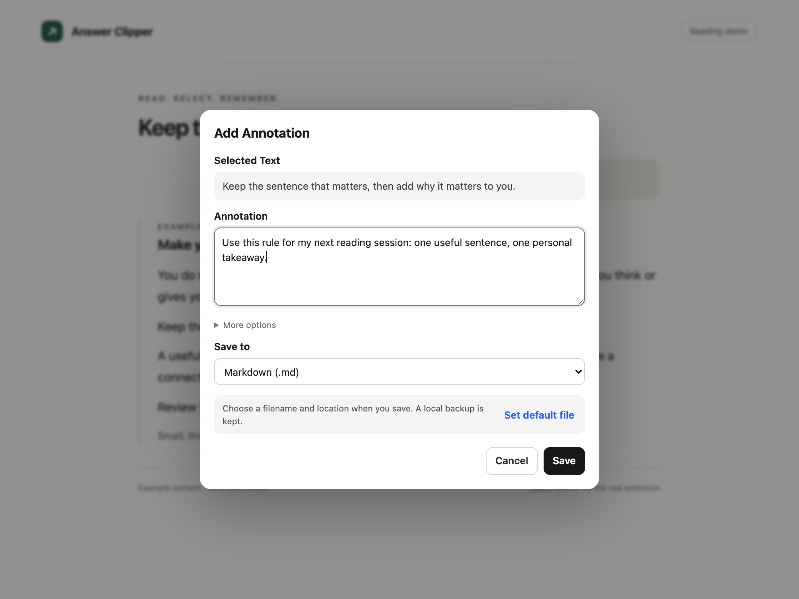

# AnyAnnotate for Chrome

AnyAnnotate lets you select text from articles, documentation, blogs, and AI conversations, add an annotation, and save it locally without interrupting your reading.



Captured from the real extension in Chromium using an English reading fixture. See the [selection and inbox screenshots](../README.md#see-it-in-action) and [test coverage](../docs/TESTING.md).

## Install from source

1. Download or clone the repository.
2. Open `chrome://extensions`.
3. Enable **Developer mode**.
4. Select **Load unpacked**.
5. Choose the `chrome-extension` directory.
6. Open or refresh an HTTP or HTTPS web page, including ChatGPT.

For an existing installation, use **Reload** on the extension card and refresh your pages. Review any updated site-access prompt. Reloading preserves the local inbox; you do not need to uninstall the extension. Chrome's site-access controls can restrict it to websites you choose.

## Use

1. Select text on a supported web page.
2. Select **Annotate** beside the selection.
3. Add an optional annotation. **More options** contains category and tags for your local record.
4. Choose **Markdown (.md)**, **Plain text (.txt)**, **Google Docs**, or **Local inbox (export later)** in **Save to**.
5. Click the single **Save** button. Your last saved choice becomes the default for the next annotation.

The extension always keeps a local IndexedDB copy first. Markdown and TXT saves ask for a filename and location unless a reusable file for that format is connected in Settings. Each format has its own optional file; switching formats never appends TXT to your Markdown file. The popup and settings page export the inbox in either format.

When appending to an existing file, the extension adds a missing blank-line separator without rewriting earlier content. Existing LF and CRLF blank lines are preserved.

Exports focus on the excerpt and your annotation, with no repeated title, field labels, category, tags, or timestamp. Google Docs uses an indented quote with a small source hyperlink; Markdown uses a blockquote and titled link. TXT uses quotation marks and a short source title without a long URL. Full metadata and the complete source URL stay in the local inbox. Existing files and Google entries are not rewritten.

Choose **Local inbox (export later)** to collect many annotations before exporting. If a file or Google write fails, your local copy and open draft remain available, with an error and the option to choose another destination. Canceling a download also preserves the local copy.

## Local HTML and page support

To annotate a local HTML file, open **Details** on the extension card in `chrome://extensions` and enable **Allow access to file URLs**. Then open your HTML file in Chrome, such as `tests/e2e/reading-fixture.html`.

Standard text selections in the top-level page are supported. Input fields, password fields, and rich-text editors are ignored. Embedded frames, canvas-rendered documents, Chrome settings, the Chrome Web Store, and built-in PDF viewers are not supported. Use the macOS app for applications that expose their selection through Accessibility.

## Privacy

Local mode keeps selected text, annotations, tags, page titles, URLs, and timestamps on the user's device. Optional Google Docs saving sends the quote, annotation, source title and supported source link directly to Google after connection and an explicit save or export action. Category, tags, and timestamps remain local. The extension has no backend, analytics, or AI calls. See [PRIVACY.md](PRIVACY.md).

## Google Docs destination

The maintainer must configure a Google OAuth client for this extension ID before Google login works. [Setup instructions](../docs/GOOGLE_DOCS.md) are also available inside Settings when the build is not configured.

After setup, open **Configure Save Destinations > Google Docs > Connect Google**. Paste an existing document link or create a document. Choose **Google Docs** in the annotation's **Save to** selector and click **Save**, or select **Export Inbox to Google Docs** for a batch export. Notes remain in the local inbox, and retries skip clips already tracked in the chosen document tab. Google setup can be opened from the annotation without discarding the draft; return to the page after setup to refresh its destination details.

## Test and package

```bash
npm ci
npm test
npx playwright install chromium
npm run test:e2e
npm run screenshots
../scripts/package-chrome-extension.sh
```

Node.js 20 or later is required for development tests. `npm run screenshots` runs the browser checks and refreshes the three README images only after all checks pass. The packaging script creates a versioned ZIP in the repository's ignored `dist` directory; tests, screenshots, and development dependencies are excluded.
